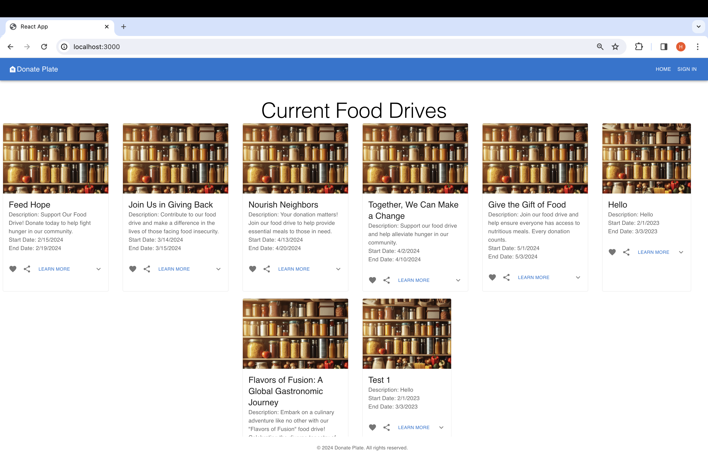
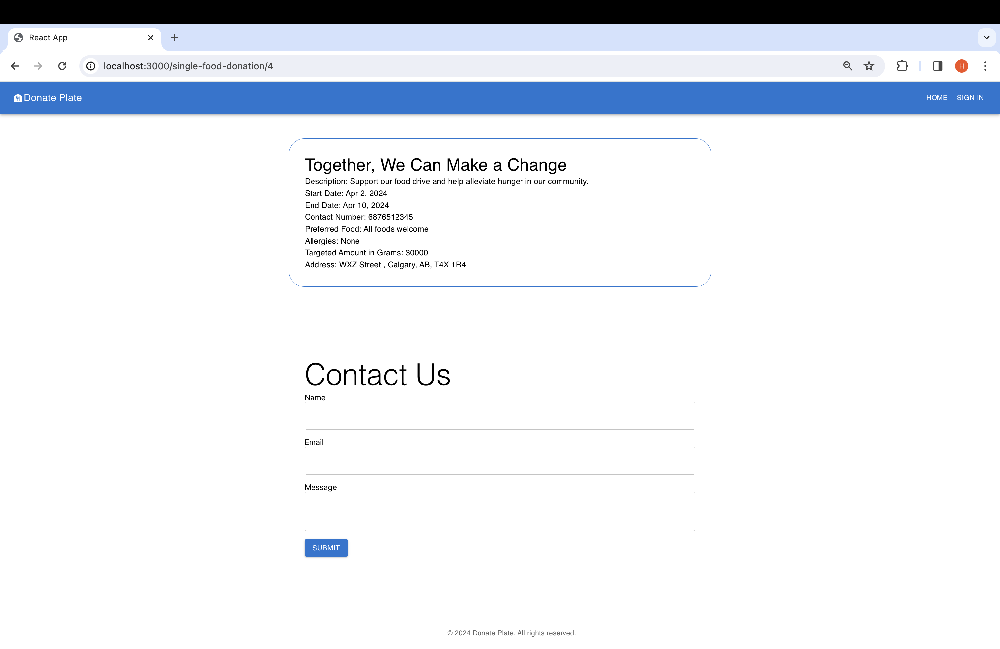
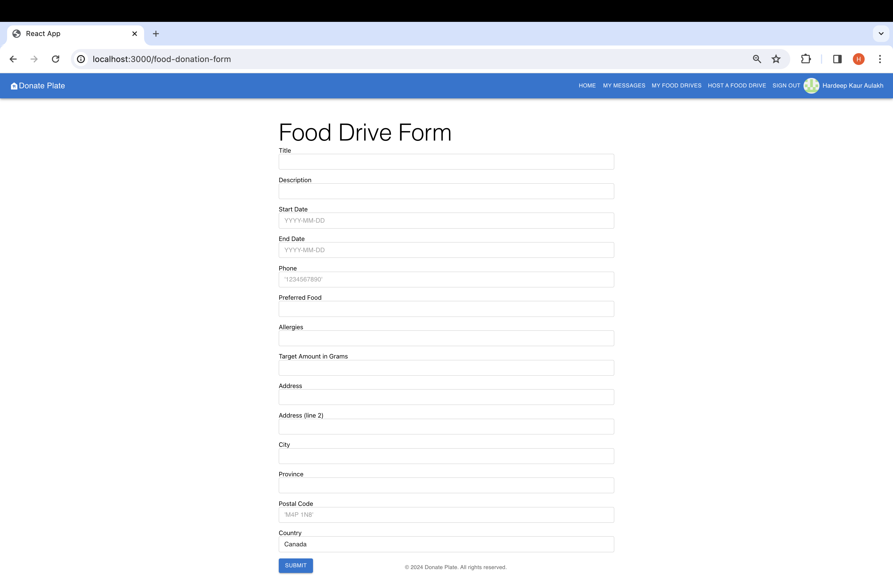
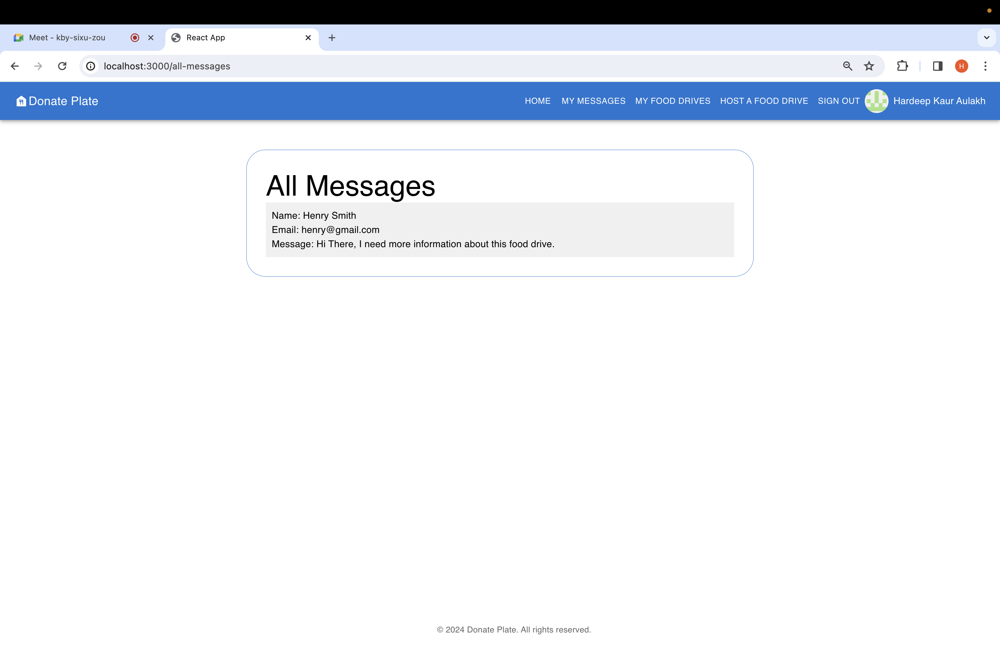
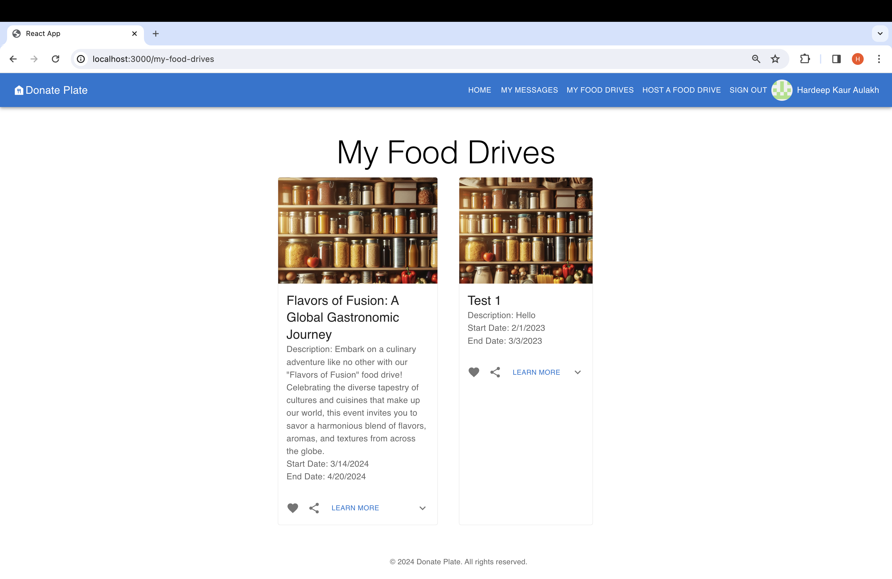

# LHL DonatePlate Website
## Overview
The LHL DonatePlate Website is an interactive platform designed to create food drives. This document will guide you through the process of setting up and running the project.

## Final product

## Dependencies
Please ensure that the following dependencies are installed before setting up the LHL DonatePlate Website:
- auth0 2.2.4
- material ui
- React 18.2.0
- Axios
- Formik
- react-router 6.22.0
- pg
- sass
- express
- dotenv
- morgan

## Getting Started
Setting up the LHL DonatePlate Website involves the following steps:

1. Clone the repository: git clone `https://github.com/uzernamex/DonatePlate/tree/main`
2. Open the project in your preferred code editor.
3. Navigate to the project directory via a terminal or command prompt.
4. Install dependencies using the `npm install` command.
5. Start the web server using the `npm run local` command.
6. Create a PostgreSQL database to house the DonatePlate data.
7. Create a .env file in the project root directory and add the following environment variables:

- DB_HOST=localhost
- DB_USER=labber 
- DB_PASS=labber
- DB_NAME=finals
- DB_PORT=5432

8. Reset the database using npm run db:reset. Use this command each time there is a change to the database schema or seeds.
- Check the db folder to see what gets created and seeded in the DB.
## Running the Project
Start the LHL DonatePlate Website with npm run local. The site will be accessible at `http://localhost:3000/`. Note: nodemon is used, so restarting your server shouldn't be necessary.

## Feedback and Collaboration
If you have any questions or suggestions, we welcome you to reach out.

## Collaborators
This project is the result of the combined efforts of:
 - [Hardeep Aulakh](https://github.com/aulakhhardeep)
 - [Ayesha Cumberbatch](https://github.com/uzernamex)

If you have any queries or wish to contribute, feel free to contact us. 
